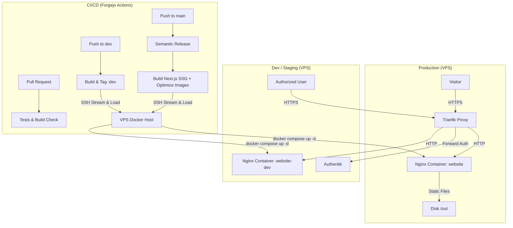

# System Architecture

## Overview

The DPSG Wehr website is a **Statically Generated (SSG)** Next.js application designed for high performance, low maintenance, and simple hosting. Content is written in Markdown / MDX files stored in the repository.

## Architecture Diagram

## Content Management

Content is managed directly in Markdown/MDX within the `content/` directory:

- `content/pages/`: Static generic pages (e.g. `startseite.mdx`, `impressum.mdx`).
- `content/posts/`: News posts and blog entries.
- `content/gruppen/`: Youth group pages (e.g. `woelflinge.mdx`, `rover.mdx`).
- `content/global/index.json`: Global navigation and footer link structure.

## Build Pipeline

When running `pnpm build` or in Forgejo Actions:

1. **ICS Generation:** Generates public (and optional internal) `.ics` calendar files via `scripts/generate-ics.ts`.
2. **Search Indexing:** Generates Fuse.js search index via `scripts/generate-search-index.ts`.
3. **Next.js Export:** Exports static HTML/JS/CSS to `out/`.
4. **Image Optimization:** Optimizes and converts images to WebP via `next-image-export-optimizer`.
5. **CSS Inlining:** Inlines critical CSS for fast rendering via `scripts/inline-css.mjs`.

## Deployment Workflow

### 1. Production Deployment (`main` branch)

1.  **Code Change:** Commit and push to `main` (or merge PR into `main`).
2.  **Release Workflow:** Semantic Release bumps version and creates release tag.
3.  **Docker Build Workflow:**
    - Builds static export in Forgejo Actions runner.
    - Packages `out/` into lightweight `nginx:alpine` image using `Dockerfile.static`.
    - Streams Docker image directly to the VPS over SSH (`docker save | ssh docker load`).
4.  **VPS Deploy:** The VPS updates the container (`docker compose up -d website`).

### 2. Test / Dev Deployment (`dev` branch)

1.  **Code Change:** Commit and push to `dev`.
2.  **Docker Build Workflow:**
    - Builds static export in Forgejo Actions runner.
    - Packages `out/` into lightweight `nginx:alpine` image using `Dockerfile.static`.
    - Streams Docker image directly to the VPS over SSH (`docker save | ssh docker load`).
3.  **VPS Deploy:** The VPS updates the dev container (`docker compose up -d website-dev`).
4.  **Authentication & Routing:** Traefik routes the test subdomain (`DEV_DOMAIN`, e.g. `dev.dpsg-wehr.de`) through the configured Authentik forward-auth middleware (`AUTHENTIK_MIDDLEWARE`, e.g. `authentik@docker`), restricting access to authenticated users.

## Developer Setup

### Prerequisites

- Node.js 22+
- pnpm 10+

### Local Development

1. `pnpm install`
2. `pnpm dev` (Runs at `http://localhost:3000`)

### VPS Setup

1. Clone repo.
2. Run `./scripts/setup-vps.sh` to initialize `.env`.
3. Start stack: `docker compose up -d`.
